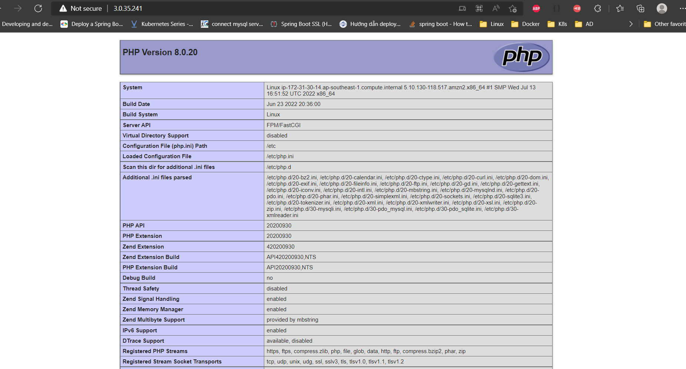

## Bài 1: Hãy viết mã Terraform để dựng một web server bao gồm: Nginx và PHP 8.x trong một EC2

- Đường link vào web sau khi chạy thành công: http://3.0.35.241

Kết quả sau khi chạy sẽ hiển thị thông tin qua hàm Phpinfo():

