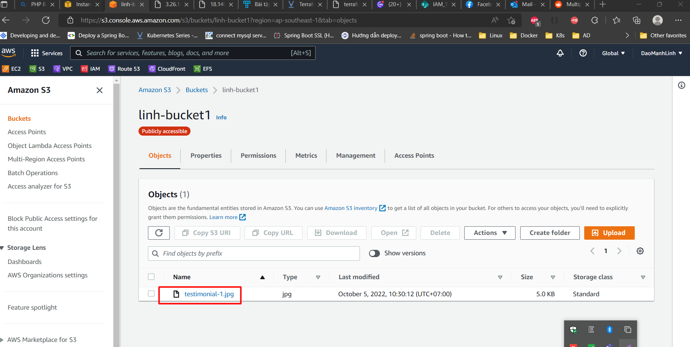

## Bài 2: Hãy triển khai một web app viết bằng Golang lắng nghe ở cổng 80. Web app này sẽ chạy trong một EC2 instance cho phép người dùng upload file vào S3 bucket
Bài này hiện tại em vẫn đang bị vướng ở chỗ Bash script chắc code chưa đúng, nên giải pháp của em nhanh nhất có thể là em sẽ tiến hành biên dịch file main.go ở local sau đó tiến hành copy file này vào EC2 và cuối cùng sẽ chạy file script.sh để start server. Mục đích sẽ chạy được web và upload được ảnh vào đúng bucket của mình

- Đường link vào web sau khi chạy thành công: http://3.26.182.48

- Link code git: https://github.com/manhlinh89/thuchanh/tree/main/bai2

Kết quả sau khi chạy sẽ hiển thị thông tin qua hàm Phpinfo():

- Giao diện trang web

-	Khi chưa được upload thì bucket đang rỗng

-	Sau khi upload thành công:

- Check trên bucket kết quả đã có file được upload lên

