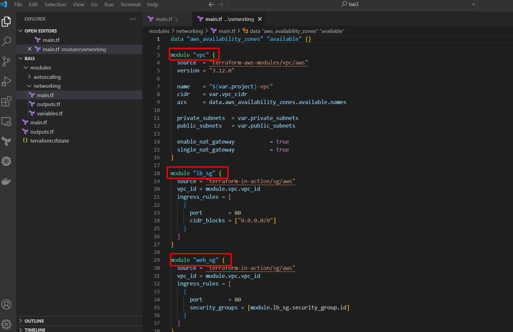
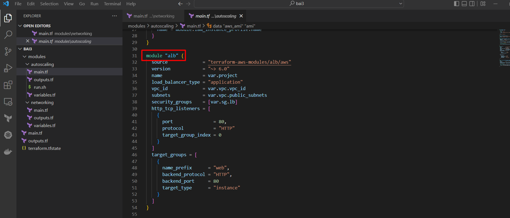
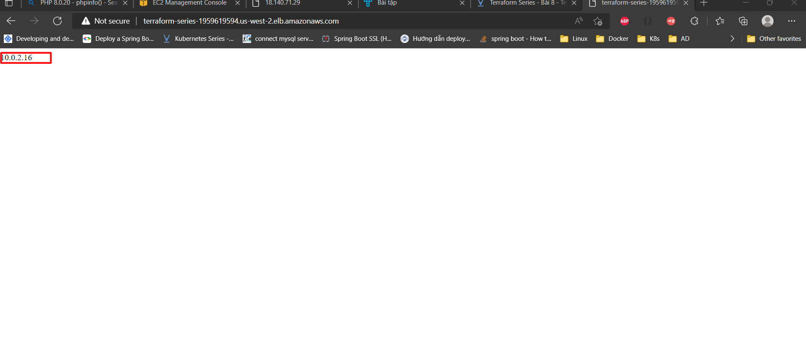
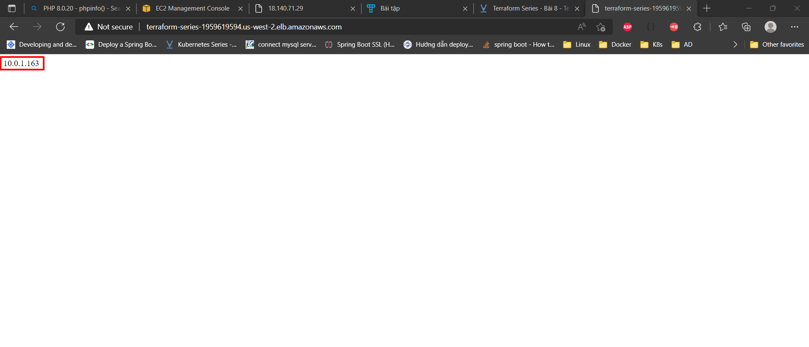

## Bài 3: Hãy sử dụng module tạo VPC và ALB để dựng một application load balancer

Mô hình hệ thống như sau:

- DNS name web: terraform-series-1959619594.us-west-2.elb.amazonaws.com

Bài này em tham khảo và sử dụng các module sau:
1. 	Module tạo VPC và module tạo Security group

2.	Module tạo ALB

Các thông số còn lại thì vẫn lấy bình thường như các project khác.
## Kết quả sau khi run terraform:

Refresh trang thì sẽ round đến 2 EC2 privateIP như bên dưới:
- Thông tin EC1 IP

- Thông tin EC2 IP

